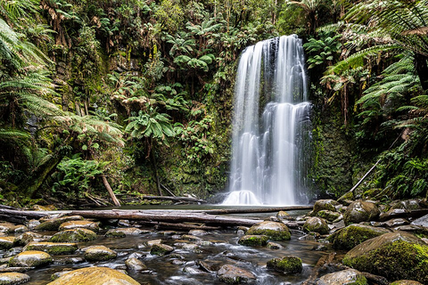
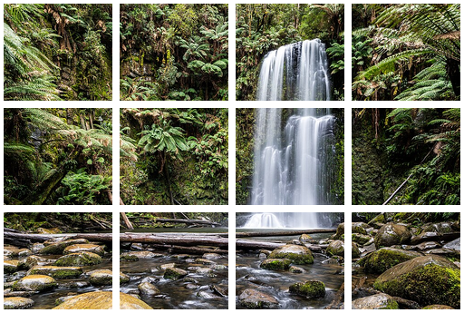

# MC-cli

A command-line tool to split an image into a grid of tiles, merge several
images into a grid, and (bonus) reconstruct an image as a photo mosaic —
built for PW1 (DAI course, HEIG-VD).

## Quick start

```sh
git clone https://github.com/nicolasreymond/MC-cli.git && cd MC-cli
./mvnw clean package
java -jar target/MC-cli.jar split examples/banque/forest_1.bmp out/ -r 3 -c 4
```

The 12 tiles land in `out/`. Requires JDK 25, see
[Requirements](#requirements).

## Table of contents

- [Quick start](#quick-start)
- [Description](#description)
- [Requirements](#requirements)
- [Installation](#installation)
- [Usage](#usage)
  - [`split`](#split)
  - [`merge`](#merge)
  - [`mosaic`](#mosaic)
- [Supported image format](#supported-image-format)
- [Exit codes](#exit-codes)
- [Troubleshooting](#troubleshooting)
- [Project structure](#project-structure)
- [Tests](#tests)
- [Contributing](#contributing)
- [Authors](#authors)

## Description

MC-cli works on uncompressed 24-bit BMP images (see
[Supported image format](#supported-image-format)). As required by the
assignment, files are opened, read and written with `java.io` only, by
parsing the BMP format by hand instead of using `javax.imageio`.

## Requirements

- **JDK 25** or newer, not just a JRE: the sources are compiled on your
  machine (`maven.compiler.release` is 25, so an older JDK fails at
  compile time). Check with `javac -version`.
- **Git**, to get the sources.
- No Maven install needed: the project ships the Maven wrapper
  (`./mvnw`, or `mvnw.cmd` on Windows).

## Installation

```sh
git clone https://github.com/nicolasreymond/MC-cli.git
cd MC-cli
./mvnw clean package
```

This produces an executable JAR at `target/MC-cli.jar`. Check that it
runs:

```sh
java -jar target/MC-cli.jar --version
```

It should print `mc-cli 1.0-SNAPSHOT`. `--help` lists the commands.

Optionally, add an alias to your shell configuration (`~/.bashrc`,
`~/.zshrc`) so you can type `mc-cli` instead of the full command:

```sh
alias mc-cli='java -jar /path/to/MC-cli/target/MC-cli.jar'
```

The examples below use the full `java -jar target/MC-cli.jar` form, run
from the project root.

## Usage

### `split`

Cuts an image into a grid of tiles.

```sh
java -jar target/MC-cli.jar split <inputFile> <outputDir> [-r <rows>] [-c <cols>] [-s <suffix>]
```

| Option | Default | Description |
|---|---|---|
| `<inputFile>` | — | Source BMP file (positional, required) |
| `<outputDir>` | — | Destination folder for the tiles (positional, required); created if it doesn't exist |
| `-r`, `--rows` | `2` | Number of grid rows |
| `-c`, `--cols` | `2` | Number of grid columns |
| `-s`, `--suffix` | `tile` | Text appended to each tile file name, after the row/column indices |
| `-h`, `--help` | — | Show the help message |

**Output filenames**: `<row>_<col>_<suffix>.bmp`, zero-padded so a plain
alphabetical sort of the output folder matches the grid's reading order
(row by row) — useful for a later `merge` of the same tiles. Example
with a 3×17 grid: `00_00_tile.bmp`, `00_01_tile.bmp`, ...

**Non-divisible dimensions**: if the image size isn't an exact multiple
of the grid, each tile is `width/cols` × `height/rows` (integer
division) and the leftover pixels on the right/bottom edge are dropped
silently.

**Existing tiles**: if `outputDir` already contains tiles matching the
current grid size and suffix, MC-cli asks for confirmation before
overwriting them (`[y/N]`).

#### Example: split a photo into a 3×4 grid

The repository ships a few test images in `examples/banque/`. Starting
from the project root, after building:

```sh
java -jar target/MC-cli.jar split examples/banque/forest_1.bmp out/ -r 3 -c 4
```

Expected output:

```
Split forest_1.bmp into a 3x4 grid (rows x cols) in out
```

`out/` now contains 12 tiles, named in reading order:

```
0_0_tile.bmp  0_1_tile.bmp  0_2_tile.bmp  0_3_tile.bmp
1_0_tile.bmp  1_1_tile.bmp  1_2_tile.bmp  1_3_tile.bmp
2_0_tile.bmp  2_1_tile.bmp  2_2_tile.bmp  2_3_tile.bmp
```

The source image is 960×640, so each tile is 240×213: 640 is not a
multiple of 3, and the last row of pixels is dropped.

| Before (`forest_1.bmp`) | After (12 tiles) |
|---|---|
|  |  |

Running the same command again asks before overwriting:

```
Tiles already exist in the output folder. Overwrite? [y/N]
```

Use `-s` to give the tiles another name, e.g. `-s part` produces
`0_0_part.bmp`, `0_1_part.bmp`, ...

### `merge`

Assembles several images into a grid.

```sh
java -jar target/MC-cli.jar merge <inputDir> <outputFile> [-r <rows>] [-c <cols>]
```

Not implemented yet.

### `mosaic`

Bonus: reconstructs an image as a photo mosaic.

Not implemented yet.

## Supported image format

MC-cli only reads and writes **BMP** files with these properties:

| Property | Required value |
|---|---|
| Signature | `BM` |
| DIB header | `BITMAPINFOHEADER` (40 bytes) |
| Bits per pixel | 24 (one byte each for blue, green, red) |
| Compression | none (`BI_RGB`) |
| Row order | bottom-up (positive height) |

Inside the file, all multi-byte fields are little-endian, pixels are
stored as B, G, R, and each row is padded with zeros to a multiple of
4 bytes. Tiles written by MC-cli always follow this format.

### Converting an image

Many tools write BMP files with a larger header (V4/V5, 108 or 124
bytes) or 32 bits per pixel, which MC-cli rejects. To convert any image
(PNG, JPEG, or another BMP) with [ImageMagick](https://imagemagick.org):

```sh
magick input.png -type TrueColor BMP3:output.bmp
```

`BMP3:` forces the 40-byte header and `-type TrueColor` forces 24 bits
per pixel. In GIMP, use *File → Export As…* with a `.bmp` name, tick
*Do not write color space information*, and pick *24 bits R8 G8 B8*
under *Advanced Options*.

## Exit codes

| Code | Meaning |
|---|---|
| `0` | Success |
| `1` | Error while running the command (missing file, unreadable or unsupported image, invalid grid, write failure, overwrite refused) |
| `2` | Invalid usage (unknown option, missing argument); the usage message is printed |

## Troubleshooting

Errors about the image file itself are printed as
`Error: Could not read the image: <message>`.

| Message | Cause and fix |
|---|---|
| `Error: Input file does not exist.` | Check the path to the source image (relative paths start from the current directory). |
| `Error: Input is not a file: ...` | The input path is a folder. Give the path to a `.bmp` file. |
| `Not a BMP file: missing 'BM' signature.` | The file is not a BMP (e.g. a renamed PNG). [Convert it](#converting-an-image). |
| `Unsupported BMP variant: expected a 40-byte BITMAPINFOHEADER, got 124.` | V4/V5 BMP, as written by default by many editors. [Convert it](#converting-an-image) with `BMP3:`. |
| `Unsupported BMP: only 24-bit RGB is supported, got 32 bits/pixel.` | Image with an alpha channel or a palette. [Convert it](#converting-an-image) with `-type TrueColor`. |
| `Unsupported BMP: compressed bitmaps are not supported.` | RLE-compressed BMP. [Convert it](#converting-an-image). |
| `Unsupported BMP: top-down bitmaps (negative height) are not supported.` | Rows stored top to bottom. [Convert it](#converting-an-image). |
| `Invalid BMP: width and height must be positive.` | The header announces an empty image: the file is corrupted. |
| `Unexpected end of file ...` | The file is truncated or corrupted. |
| `Error: a 3x4 grid (rows x cols) is too large for a 2x2 image.` | More rows or columns than pixels. Use a smaller grid. |
| `Error: rows and cols must be positive.` | `-r` and `-c` must be at least 1. |

## Project structure

```
MC-cli/
├── pom.xml                         # Maven build: Java 25, picocli, JUnit 5, executable JAR
├── mvnw, mvnw.cmd, .mvn/           # Maven wrapper (no Maven install needed)
├── src/
│   ├── main/java/ch/heigvd/dai/
│   │   ├── Main.java               # root `mc-cli` command, registers the subcommands
│   │   ├── commandes/
│   │   │   ├── Splitter.java       # `split` command
│   │   │   └── Merger.java         # `merge` command (work in progress)
│   │   └── bmp/
│   │       ├── BmpHeader.java      # 54-byte BMP header: read, validate, write (little-endian)
│   │       └── BmpImage.java       # whole image: pixel I/O, crop, get/set pixel
│   └── test/java/ch/heigvd/dai/
│       └── bmp/BmpImageTest.java   # unit tests for the BMP classes (to be written, #18)
├── examples/banque/                # sample 24-bit BMP images to try the commands
└── docs/images/                    # PNG screenshots used in this README
```

The code is split in two layers:

- **`bmp`** is the only package that opens, reads or writes image files,
  using `java.io` only, as required by the assignment. In memory, an
  image is a plain `byte[]` of R, G, B values, top row first, without
  padding, so the commands never deal with the on-disk layout.
- **`commandes`** holds one [picocli](https://picocli.info) class per
  subcommand. Each one parses its options, validates them, and works on
  `BmpImage` objects.

To add a command, create a class in `commandes` that implements
`Callable<Integer>`, annotate it with `@Command`, and add it to the
`subcommands` list in `Main`.

## Tests

```sh
./mvnw test
```

## Contributing

The two authors work through GitHub issues and pull requests:

1. Pick an issue and assign yourself (`gh issue edit <n> --add-assignee @me`).
2. Create a branch from `dev`, named after the kind of change:
   `feat/...`, `fix/...`, `docs/...`, `test/...`, `chore/...`.
3. Commit in small steps using
   [Conventional Commits](https://www.conventionalcommits.org) messages
   (`feat(merge): ...`, `fix(split): ...`, `docs: ...`), and tick the
   matching task boxes in the issue as you go.
4. Open a pull request to `dev` with `Closes #<n>` in its description and
   ask the other author for a review.
5. Once `dev` is stable, it is merged into `main` through a pull request.

Make sure `./mvnw clean package` succeeds before opening a pull request.

## Authors

- Nicolas Reymond ([@nicolasreymond](https://github.com/nicolasreymond))
- Aymeric Bonny ([@albonny](https://github.com/albonny))
